# -Strategy-Evaluation
 Strategy Evaluation
```python
import matplotlib.pyplot as plt
import seaborn as sns
import pandas as pd
import numpy as np
import warnings
from sklearn.linear_model import LinearRegression
from sklearn.model_selection import train_test_split
# Ignore a specific warning
warnings.filterwarnings("ignore")
```


```python
#Reading the data of strategy 1
S1_df = pd.read_csv("./S1_trades.csv")
S1_df["buytime"] = pd.to_datetime(S1_df["buytime"])
```


```python
#Reading the data of strategy 2
S2_df = pd.read_csv("./S2_trades.csv")
S2_df["buytime"] = pd.to_datetime(S2_df["buytime"])
```

### Checking if the data is clean


```python
#Checking if any data is missing
sns.heatmap(S1_df.isnull())
```


    <Axes: >


    
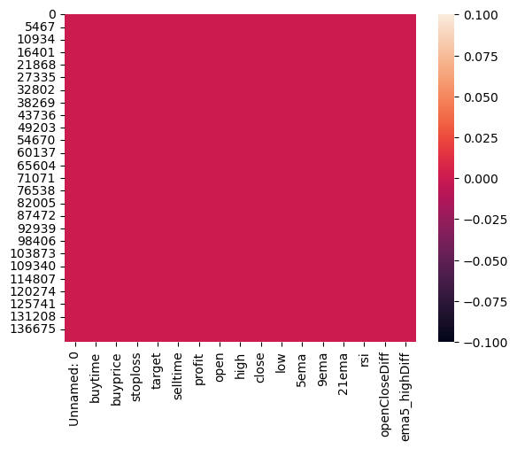
    


#### There are no null values


```python
S1_df.head()

```


<div>
<style scoped>
    .dataframe tbody tr th:only-of-type {
        vertical-align: middle;
    }

    .dataframe tbody tr th {
        vertical-align: top;
    }

    .dataframe thead th {
        text-align: right;
    }
</style>
<table border="1" class="dataframe">
  <thead>
    <tr style="text-align: right;">
      <th></th>
      <th>Unnamed: 0</th>
      <th>buytime</th>
      <th>buyprice</th>
      <th>stoploss</th>
      <th>target</th>
      <th>selltime</th>
      <th>profit</th>
      <th>open</th>
      <th>high</th>
      <th>close</th>
      <th>low</th>
      <th>5ema</th>
      <th>9ema</th>
      <th>21ema</th>
      <th>rsi</th>
      <th>openCloseDiff</th>
      <th>ema5_highDiff</th>
    </tr>
  </thead>
  <tbody>
    <tr>
      <th>0</th>
      <td>1</td>
      <td>2020-02-03 04:45:00</td>
      <td>11139.55</td>
      <td>11036.25</td>
      <td>12689.05</td>
      <td>05-03-2020 22:45</td>
      <td>-0.927327</td>
      <td>11050.30</td>
      <td>11139.55</td>
      <td>11139.50</td>
      <td>11036.25</td>
      <td>11150.922630</td>
      <td>11199.791230</td>
      <td>11275.966930</td>
      <td>29.382915</td>
      <td>0.800754</td>
      <td>0.101988</td>
    </tr>
    <tr>
      <th>1</th>
      <td>2</td>
      <td>2020-03-16 00:05:00</td>
      <td>9409.60</td>
      <td>9339.25</td>
      <td>10464.85</td>
      <td>16-03-2020 04:35</td>
      <td>-0.747641</td>
      <td>9341.55</td>
      <td>9409.60</td>
      <td>9397.65</td>
      <td>9339.25</td>
      <td>9476.545299</td>
      <td>9587.218023</td>
      <td>9733.096661</td>
      <td>29.547664</td>
      <td>0.596958</td>
      <td>0.706431</td>
    </tr>
    <tr>
      <th>2</th>
      <td>3</td>
      <td>2020-03-30 00:00:00</td>
      <td>8482.85</td>
      <td>8378.95</td>
      <td>10041.35</td>
      <td>30-03-2020 03:35</td>
      <td>-1.224824</td>
      <td>8399.15</td>
      <td>8482.85</td>
      <td>8482.25</td>
      <td>8378.95</td>
      <td>8488.085204</td>
      <td>8535.373995</td>
      <td>8602.104856</td>
      <td>37.374525</td>
      <td>0.979693</td>
      <td>0.061677</td>
    </tr>
    <tr>
      <th>3</th>
      <td>4</td>
      <td>2022-01-24 22:50:00</td>
      <td>16967.90</td>
      <td>16840.75</td>
      <td>18875.15</td>
      <td>14-02-2022 04:35</td>
      <td>-0.749356</td>
      <td>16858.70</td>
      <td>16967.90</td>
      <td>16948.10</td>
      <td>16840.75</td>
      <td>17011.592310</td>
      <td>17049.464500</td>
      <td>17093.482860</td>
      <td>37.162441</td>
      <td>0.527493</td>
      <td>0.256838</td>
    </tr>
    <tr>
      <th>4</th>
      <td>5</td>
      <td>2020-02-03 04:45:00</td>
      <td>9181.05</td>
      <td>9105.00</td>
      <td>10321.80</td>
      <td>05-03-2020 22:45</td>
      <td>-0.828337</td>
      <td>9116.40</td>
      <td>9181.05</td>
      <td>9181.05</td>
      <td>9105.00</td>
      <td>9193.645818</td>
      <td>9233.788214</td>
      <td>9296.443620</td>
      <td>27.369673</td>
      <td>0.704168</td>
      <td>0.137006</td>
    </tr>
  </tbody>
</table>
</div>


```python
S2_df.head()
```


<div>
<style scoped>
    .dataframe tbody tr th:only-of-type {
        vertical-align: middle;
    }

    .dataframe tbody tr th {
        vertical-align: top;
    }

    .dataframe thead th {
        text-align: right;
    }
</style>
<table border="1" class="dataframe">
  <thead>
    <tr style="text-align: right;">
      <th></th>
      <th>Unnamed: 0</th>
      <th>buytime</th>
      <th>buyprice</th>
      <th>stoploss</th>
      <th>target</th>
      <th>selltime</th>
      <th>profit</th>
      <th>open</th>
      <th>high</th>
      <th>close</th>
      <th>low</th>
      <th>5ema</th>
      <th>9ema</th>
      <th>21ema</th>
      <th>rsi</th>
      <th>openCloseDiff</th>
      <th>ema5_highDiff</th>
      <th>ema5_lowDiff</th>
    </tr>
  </thead>
  <tbody>
    <tr>
      <th>0</th>
      <td>1</td>
      <td>2020-04-16 23:45:00</td>
      <td>9267.65</td>
      <td>9324.00</td>
      <td>8816.85</td>
      <td>19-04-2020 23:45</td>
      <td>-0.608029</td>
      <td>9323.45</td>
      <td>9324.00</td>
      <td>9270.25</td>
      <td>9267.65</td>
      <td>9093.244150</td>
      <td>9057.858588</td>
      <td>9031.391227</td>
      <td>83.363659</td>
      <td>0.570604</td>
      <td>2.474859</td>
      <td>1.881878</td>
    </tr>
    <tr>
      <th>1</th>
      <td>2</td>
      <td>2020-12-05 23:45:00</td>
      <td>9436.45</td>
      <td>9584.50</td>
      <td>8252.05</td>
      <td>29-05-2020 05:35</td>
      <td>-1.568916</td>
      <td>9584.20</td>
      <td>9584.50</td>
      <td>9444.90</td>
      <td>9436.45</td>
      <td>9281.692869</td>
      <td>9246.177559</td>
      <td>9199.619553</td>
      <td>82.520831</td>
      <td>1.453434</td>
      <td>3.159342</td>
      <td>1.639993</td>
    </tr>
    <tr>
      <th>2</th>
      <td>3</td>
      <td>2019-01-31 22:55:00</td>
      <td>8292.20</td>
      <td>8342.70</td>
      <td>7888.20</td>
      <td>31-01-2019 23:50</td>
      <td>-0.609006</td>
      <td>8339.10</td>
      <td>8342.70</td>
      <td>8293.95</td>
      <td>8292.20</td>
      <td>8282.011285</td>
      <td>8257.723354</td>
      <td>8216.467497</td>
      <td>71.358583</td>
      <td>0.541425</td>
      <td>0.727447</td>
      <td>0.122871</td>
    </tr>
    <tr>
      <th>3</th>
      <td>4</td>
      <td>2020-04-16 23:45:00</td>
      <td>5520.30</td>
      <td>5586.65</td>
      <td>4989.50</td>
      <td>17-04-2020 01:45</td>
      <td>-1.201927</td>
      <td>5586.40</td>
      <td>5586.65</td>
      <td>5532.10</td>
      <td>5520.30</td>
      <td>5445.379175</td>
      <td>5424.244188</td>
      <td>5400.354406</td>
      <td>82.290403</td>
      <td>0.972003</td>
      <td>2.528722</td>
      <td>1.357188</td>
    </tr>
    <tr>
      <th>4</th>
      <td>5</td>
      <td>2020-12-05 23:45:00</td>
      <td>5951.15</td>
      <td>6033.95</td>
      <td>5288.75</td>
      <td>28-05-2020 01:30</td>
      <td>-1.391328</td>
      <td>6014.20</td>
      <td>6033.95</td>
      <td>5959.95</td>
      <td>5951.15</td>
      <td>5793.140457</td>
      <td>5753.175689</td>
      <td>5703.668616</td>
      <td>87.835572</td>
      <td>0.902032</td>
      <td>3.990910</td>
      <td>2.655109</td>
    </tr>
  </tbody>
</table>
</div>


### This function will calculate daily profit 


```python
def calulateProfitArr(profitArr):
    p = 0
    temp = []
    for i in profitArr:
        p = p+i
        temp.append(p)
    return temp

def calculateMonthlyProfit(time,profit):
    monthDict = {}
    for t,p in zip(time,profit):
        s = str(t.month)+"-"+str(t.year)
        if(s in monthDict):
            monthDict[s] = monthDict[s]+p
        else:
            monthDict[s] = p
    return monthDict
```


```python
nifty_50 = pd.read_csv("./nifty50.csv")
nifty_50["timestamp"] = pd.to_datetime(nifty_50["timestamp"])
```


```python
#Visualizing NIFTY 50 with respect to time.
fig, ax = plt.subplots(figsize=(15, 6))
fig.suptitle('Nifty 50 2018 - 2023', fontsize=30)
ax.plot(nifty_50["timestamp"],nifty_50["close"])
```


    [<matplotlib.lines.Line2D at 0x2a236c6f590>]


    
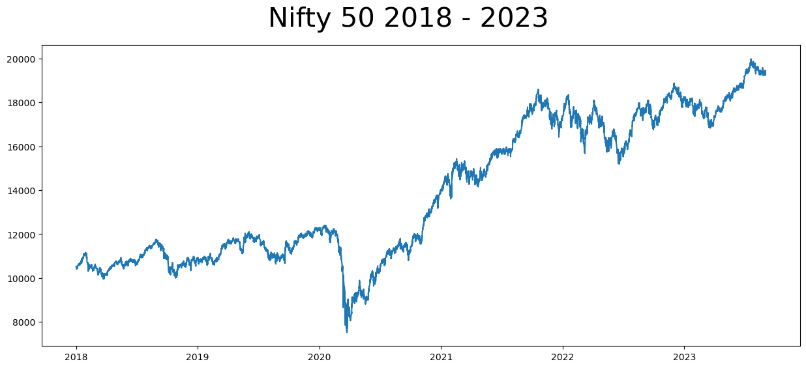
    


#### The plot above represents the market condition over 5 years of time

#### Now we will make an analysis on both of the strategy.


```python
fig, ax = plt.subplots(1, 2,figsize=(15,5), gridspec_kw={"width_ratios": [2, 4]})
fig.suptitle(' Strategy 1 ', fontsize=30)
profit = calulateProfitArr(S1_df["profit"])
ax[0].plot(profit)
ax[0].set_title("Daily Profit")
monthDict = calculateMonthlyProfit(S1_df["buytime"],S1_df["profit"])
ax[1].bar(list(monthDict.keys()), list(monthDict.values()), color ='maroon')
ax[1].set_title("Monthly Profit")
```


    Text(0.5, 1.0, 'Monthly Profit')


    
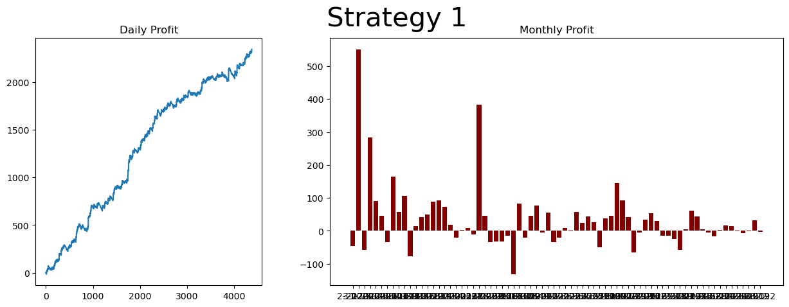
    


```python
fig, ax = plt.subplots(1, 2,figsize=(15,5), gridspec_kw={"width_ratios": [2, 4]})
fig.suptitle(' Strategy 2 ', fontsize=30)
profit = calulateProfitArr(S2_df["profit"])
ax[0].plot(profit)
ax[0].set_title("Daily Profit")
monthDict = calculateMonthlyProfit(S2_df["buytime"],S2_df["profit"])
ax[1].bar(list(monthDict.keys()), list(monthDict.values()), color ='maroon')
ax[1].set_title("Monthly Profit")
```


    Text(0.5, 1.0, 'Monthly Profit')


    
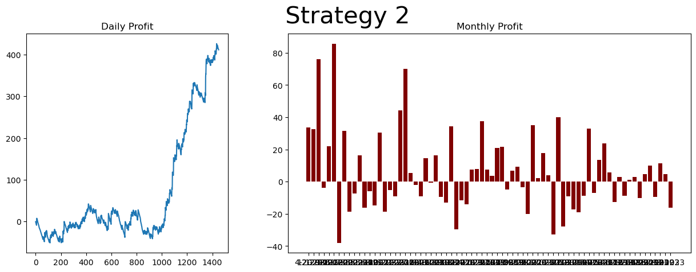
    


# We have visualized the data of both the strategies. Now we will calculate the volatality of the strategy for risk analysis

The simplest approach to determine the volatility of a security is to calculate the standard deviation of its prices over a period of time.

The standard deviation is a measure of the amount of variation or dispersion in a set of values. In the context of financial data or investment returns, a high standard deviation is often associated with higher volatility.


```python
#For better understanding, calculate volatality of last 3 years only
volatalityList = []
assetsList = [S1_df,S2_df]
t = ["S1_df","S2_df"]
for asset,n in zip(assetsList,t):
    assetList = asset["close"].tolist()
    mean = np.mean(assetList)
    sqdiff = []
    for i in assetList:
        temp = i - mean
        sqdiff.append(temp**2)
    suma = np.sum(sqdiff)
    variance = suma/len(assetList)
    sd = variance**(1/2)
    volatalityList.append(sd)
    print(n,"--->",sd)
    
```

    S1_df ---> 2664.3971768019874
    S2_df ---> 2096.280837281289
    

Strategy 1:  2664.39
--
The standard deviation of 2664.39 indicates the historical volatility of returns for the strategy 1 dataset. It suggests that Strategy 1 returns have experienced high volatility over the given time period.

Strategy 2:  2096.280
--
The standard deviation of 2096.280 indicates the historical volatility of returns for the strategy 2 dataset. It suggests that Strategy 2 returns have experienced high volatility over the given time period. But less that Strategy 1

# 

#### We will create a new dataset using the above 3 datasets of SGB, where we will calculate the weights of the assets to be invested depending on the investors risk 

# PORTFOLIO STATISTICS


```python
SG = pd.concat([S1_df['profit'], S2_df['profit']], axis = 1)
SG.columns = ['Strategy 1', 'Strategy 1']
SG.head()
```


<div>
<style scoped>
    .dataframe tbody tr th:only-of-type {
        vertical-align: middle;
    }

    .dataframe tbody tr th {
        vertical-align: top;
    }

    .dataframe thead th {
        text-align: right;
    }
</style>
<table border="1" class="dataframe">
  <thead>
    <tr style="text-align: right;">
      <th></th>
      <th>Strategy 1</th>
      <th>Strategy 1</th>
    </tr>
  </thead>
  <tbody>
    <tr>
      <th>0</th>
      <td>-0.927327</td>
      <td>-0.608029</td>
    </tr>
    <tr>
      <th>1</th>
      <td>-0.747641</td>
      <td>-1.568916</td>
    </tr>
    <tr>
      <th>2</th>
      <td>-1.224824</td>
      <td>-0.609006</td>
    </tr>
    <tr>
      <th>3</th>
      <td>-0.749356</td>
      <td>-1.201927</td>
    </tr>
    <tr>
      <th>4</th>
      <td>-0.828337</td>
      <td>-1.391328</td>
    </tr>
  </tbody>
</table>
</div>


#### Calculate daily returns mean


```python
SG.pct_change(1).mean()
```


    Strategy 1   -1.534073
    Strategy 1   -0.406313
    dtype: float64


#### Calculate correlation between assets


```python
sns.heatmap(SG.pct_change(1).corr())
```


    <Axes: >


    
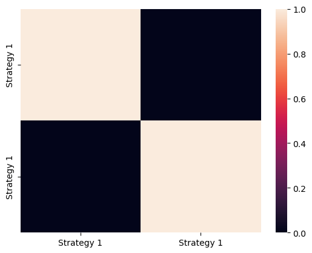
    


#### As we can see the assets are very less correlated with each other.

#### Calculating log return of assets for covariance

#### A histogram is a graphical representation of the distribution of a dataset. It's a way to visualize the underlying frequency distribution of a set of continuous or discrete data.


```python
log_returns = np.log(SG/SG.shift(1))
log_returns.hist(bins = 100, figsize = (12,8), color=['g', 'b'])
plt.tight_layout()
```


    
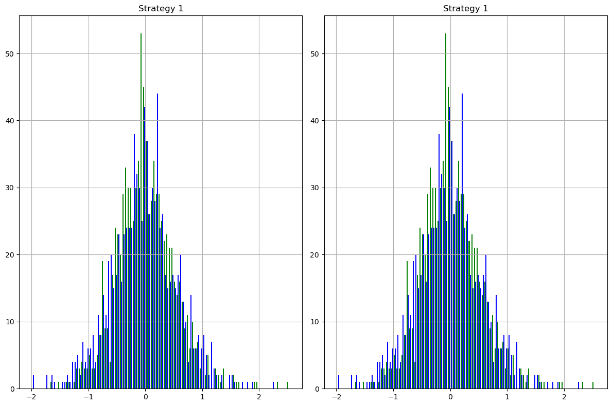
    


#### Covarience of the columns:


```python
log_returns.cov()*252
```


<div>
<style scoped>
    .dataframe tbody tr th:only-of-type {
        vertical-align: middle;
    }

    .dataframe tbody tr th {
        vertical-align: top;
    }

    .dataframe thead th {
        text-align: right;
    }
</style>
<table border="1" class="dataframe">
  <thead>
    <tr style="text-align: right;">
      <th></th>
      <th>Strategy 1</th>
      <th>Strategy 1</th>
    </tr>
  </thead>
  <tbody>
    <tr>
      <th>Strategy 1</th>
      <td>87.084525</td>
      <td>0.041551</td>
    </tr>
    <tr>
      <th>Strategy 1</th>
      <td>0.041551</td>
      <td>84.826408</td>
    </tr>
  </tbody>
</table>
</div>


#### Calculating random weights for portfolio


```python
np.random.seed()
print(SG.columns)

weights = np.array(np.random.random(2))

print('Random Weights: ')
print(weights)

#However, their sum must be equal to 100
print('Rebalance')
weights = weights/np.sum(weights)
print(weights)
```

    Index(['Strategy 1', 'Strategy 1'], dtype='object')
    Random Weights: 
    [0.88374282 0.03435118]
    Rebalance
    [0.96258424 0.03741576]
    


```python
exp_ret = np.sum((log_returns.mean() * weights) * 252)
print('Expected Portfolio Return: ',exp_ret)
```

    Expected Portfolio Return:  -0.1541811451711252
    


```python
exp_vol = np.sqrt(np.dot(weights.T,np.dot(log_returns.cov() * 252, weights)))
print('Expected Volatility: ', exp_vol)
```

    Expected Volatility:  8.989522577730025
    


```python
SR = exp_ret/exp_vol
print('Sharpe Ratio: ', SR)
```

    Sharpe Ratio:  -0.017151205065448316
    

#### Now we will create a dataset with the above information. Dataset will have weights of the assets, volatality of the portfolio and the sharpe ratio as the independent variables and the portfolio return as the dependent variable


```python
num_ports = 5000
all_weights = np.zeros((num_ports,len(SG.columns)))
ret_arr = np.zeros(num_ports)
vol_arr = np.zeros(num_ports)
sharpe_arr = np.zeros(num_ports)
S1 = [];S2 = []

for ind in range(num_ports):
    weights = np.array(np.random.random(2))
    weights = weights / np.sum(weights)
    S1.append(weights[0])
    S2.append(weights[1])
    all_weights[ind,:] = weights
    ret_arr[ind] = np.sum((log_returns.mean() * weights) *252)
    vol_arr[ind] = np.sqrt(np.dot(weights.T, np.dot(log_returns.cov() * 252, weights)))
    sharpe_arr[ind] = ret_arr[ind]/vol_arr[ind]
finalDataset = pd.DataFrame()
finalDataset["Strategy1"] = S1
finalDataset["Strategy2"] = S2
finalDataset["Voltality"] = vol_arr
finalDataset["SharpeRatio"] = sharpe_arr
finalDataset["Returns"] = ret_arr
```


```python
finalDataset.head()
```


<div>
<style scoped>
    .dataframe tbody tr th:only-of-type {
        vertical-align: middle;
    }

    .dataframe tbody tr th {
        vertical-align: top;
    }

    .dataframe thead th {
        text-align: right;
    }
</style>
<table border="1" class="dataframe">
  <thead>
    <tr style="text-align: right;">
      <th></th>
      <th>Strategy1</th>
      <th>Strategy2</th>
      <th>Voltality</th>
      <th>SharpeRatio</th>
      <th>Returns</th>
    </tr>
  </thead>
  <tbody>
    <tr>
      <th>0</th>
      <td>0.493364</td>
      <td>0.506636</td>
      <td>6.556759</td>
      <td>-0.379111</td>
      <td>-2.485743</td>
    </tr>
    <tr>
      <th>1</th>
      <td>0.675300</td>
      <td>0.324700</td>
      <td>6.976720</td>
      <td>-0.226711</td>
      <td>-1.581701</td>
    </tr>
    <tr>
      <th>2</th>
      <td>0.890549</td>
      <td>0.109451</td>
      <td>8.371917</td>
      <td>-0.061172</td>
      <td>-0.512127</td>
    </tr>
    <tr>
      <th>3</th>
      <td>0.278097</td>
      <td>0.721903</td>
      <td>7.138517</td>
      <td>-0.498060</td>
      <td>-3.555407</td>
    </tr>
    <tr>
      <th>4</th>
      <td>0.666112</td>
      <td>0.333888</td>
      <td>6.936492</td>
      <td>-0.234607</td>
      <td>-1.627352</td>
    </tr>
  </tbody>
</table>
</div>


```python
sns.heatmap(finalDataset.corr())
```


    <Axes: >


    
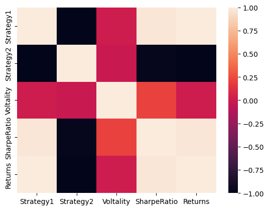
    


#### Correlation between the categories are good.


```python
sharpe_arr.max()
```


    0.0032015182927659426


```python
all_weights[sharpe_arr.argmax(),:]
```


    array([9.99623049e-01, 3.76950894e-04])


```python
plt.figure(figsize = (12,8))
plt.scatter(vol_arr,ret_arr,c=sharpe_arr,cmap='Spectral')
plt.colorbar(label='Sharpe Ratio')
plt.xlabel('Volatility')
plt.ylabel('Return')

# Add red dot for max SR
max_sr_ret = ret_arr[sharpe_arr.argmax()]
max_sr_vol = vol_arr[sharpe_arr.argmax()]
plt.scatter(max_sr_vol,max_sr_ret,c='red',s=50,edgecolors='black');
```


    
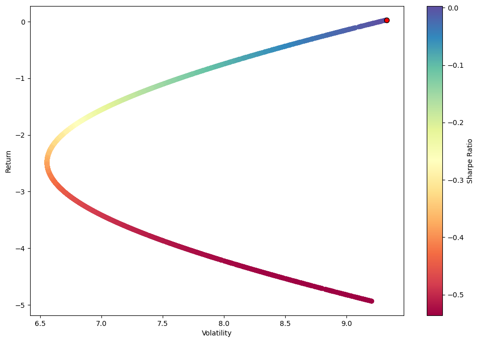
    


#### This plot indicates that as the volatality increases, The sharpe ratio and return decreases


```python
plt.scatter(finalDataset["SharpeRatio"],finalDataset["Returns"])
plt.title("Sharpe Ratio vs Portfolio Returns")
```


    Text(0.5, 1.0, 'Sharpe Ratio vs Portfolio Returns')


    
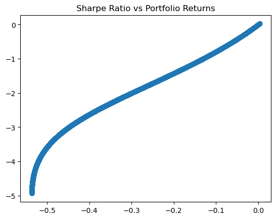
    


```python
#Error function (cost function). To minimze the error function we need to vary the values
#of m(slope of the linear regression line) and b (y intercept).
# We are using gradient descent to perform linear regression
def error_function(m,b,L,x_train,y_train):
    pd_m = 0
    pd_b = 0
    for i in range(0,len(x_train)):
        x = x_train[i]
        y = y_train[i]
        #Calculating partial derivative wrt m and b individually
        pd_m = pd_m + (-2/len(x_train))*(x*(y -(m*x+b)))
        pd_b = pd_b + (-2/len(x_train))*(y -(m*x+b))
        
    new_m = m-(L*pd_m)
    new_b = b-(L*pd_b)
    return new_m,new_b
```


```python
def MSE(m,b, X, y):
    total_cost = 0
    for i in range(len(X)):
        total_cost += (y[i] - (m * X[i] + b)) ** 2
    return total_cost / float(len(X))
```


```python
#Split training and testing data using sklearn model selection.
X_train,X_test,y_train,y_test = train_test_split(finalDataset['SharpeRatio'],finalDataset['Returns'],test_size=0.2, random_state=101)
```


```python
# Training Set
m = 0
b = 0
L = 0.004
epoch = 20000

mse_training = []
mse_testing = []
for i in range(0,epoch):
    m,b = error_function(m,b,L,X_train.tolist(),y_train.tolist())
    mse_training.append(MSE(m,b,X_train.tolist(),y_train.tolist()))
    mse_testing.append(MSE(m,b,X_test.tolist(),y_test.tolist()))
```


```python
# figure, axis = plt.subplots(2,1,figsize=(10, 10))
plt.plot(mse_training,label="Training Set")
plt.plot(mse_testing,label="Testing Set")
plt.legend()
plt.title("MSE VS Iterations")
plt.xlabel("Iterations")
plt.ylabel("MSE")

```


    Text(0, 0.5, 'MSE')


    
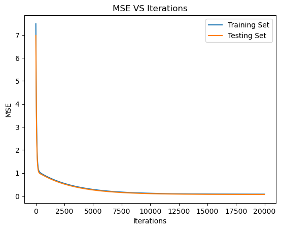
    


#### MSE is constant after 20000 iterations


```python
linear_regression2 = []
X_trainList = X_train.tolist()
for i in range(0,len(X_train)):
    linear_regression2.append(m*X_trainList[i] + b)
# print(linear_regression)
figure, axis = plt.subplots(1,2,figsize=(10, 5))
axis[0].scatter(X_trainList,y_train.tolist())
axis[0].plot(X_trainList,linear_regression2,color = "red")
axis[0].set_title("Training Set")


y_test_pred = []
X_testList = X_test.tolist()
for i in range(0,len(X_testList)):
    y_test_pred.append(m*X_testList[i] + b)
# print(linear_regression)
axis[1].scatter(X_testList,y_test.tolist())
axis[1].plot(X_testList,y_test_pred,color = "red")
axis[1].set_title("Testing data vs Prediction")
```


    Text(0.5, 1.0, 'Testing data vs Prediction')


    
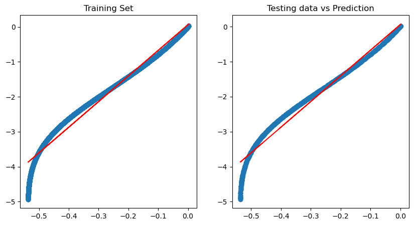
    


```python
import sklearn.metrics as sm

print("Mean absolute error =", round(sm.mean_absolute_error(y_test, y_test_pred), 2)) 
print("Mean squared error =", round(sm.mean_squared_error(y_test, y_test_pred), 2)) 
print("Median absolute error =", round(sm.median_absolute_error(y_test, y_test_pred), 2)) 
print("Explain variance score =", round(sm.explained_variance_score(y_test, y_test_pred), 2)) 
print("R2 score =", round(sm.r2_score(y_test, y_test_pred), 2))
```

    Mean absolute error = 0.18
    Mean squared error = 0.06
    Median absolute error = 0.14
    Explain variance score = 0.95
    R2 score = 0.95
    


```python

```
